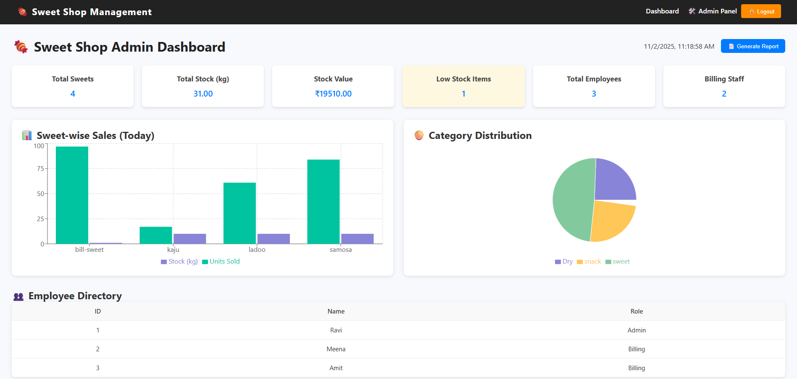
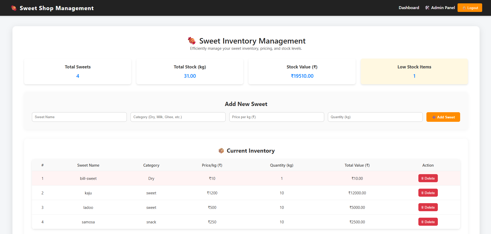
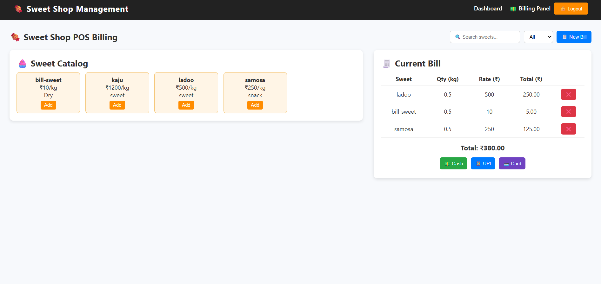

# Sweet Shop Management System

Repository: https://github.com/sadanandsl/SweetManagementSystem

This repository contains a full-stack Sweet Shop Management System built with:

- Backend: FastAPI (Python) + SQLAlchemy + SQLite
- Frontend: React (Create React App) with Axios

This project was developed with a TDD mindset and includes automated tests for backend functionality.

## What’s included

- Backend API with authentication (JWT)
- Sweets management admin-protected for create and delete; 
- Search sweets by name, category, price range
- Billing endpoints to purchase (billing role) and restock (admin role)
- React frontend with login/register, dashboard, admin panel, and protected routes
- Pytest test-suite for backend (auth, sweets, billing, authorization)

## Quick start — Backend (Windows PowerShell)

1. Create & activate a virtual environment (optional but recommended):

```powershell
python -m venv .venv
.\.venv\Scripts\Activate
```

2. Install dependencies:

```powershell
pip install -r backend\requirements.txt
pip install httpx pytest
```

3. Start the backend (development):

```powershell
cd backend
uvicorn app.main:app --reload --port 8000
```

The backend will run at http://127.0.0.1:8000

API root: `GET /` → `{"message": "Sweet Shop API is running"}`

Notes:
- The app uses SQLite by default (`backend/app/sweetshop.db`). When you change models (e.g., add `category`), you may need to delete this file so SQLAlchemy can recreate tables with the new schema while developing.

## Quick start — Frontend

1. Install dependencies and start the React app:

```powershell
cd frontend
npm install
npm start
```

The frontend will run at http://localhost:3000 and expects the backend at http://127.0.0.1:8000 (configured in `frontend/src/api/axiosConfig.js`).

If you get `Exit Code 1` when running `npm start`, run `npm install` first and paste the full error here so it can be diagnosed.

## Running tests (backend)

Make sure your backend virtualenv is active and dependencies are installed (see above). Then run:

```powershell
cd backend
python -m pytest -q
```

The tests will recreate the SQLite DB before running to ensure a fresh test environment. Tests cover:
- User registration & login
- Role-based access control (admin vs billing)
- Sweets creation, search, duplicate checks
- Billing sell and insufficient stock handling

## API Endpoints (implemented)

- Auth
  - POST /api/auth/register — register user (role: `admin` or `billing`)
  - POST /api/auth/login — login and receive JWT

- Sweets (protected)
  - GET /api/sweets — list all sweets
  - GET /api/sweets/search?q=&category=&min_price=&max_price= — search
  - POST /api/sweets — create sweet (admin only)
  - DELETE /api/sweets/{id} — delete sweet (admin only)

- Billing (protected)
  - POST /api/billing/sell?sweet_id=&quantity_sold= — sell (billing role)
  - POST /api/billing/restock?sweet_id=&amount= — restock (admin only)


## Screenshots

Add screenshots of the running frontend and API responses. Place image files in `frontend/src/screenshots/` and they'll appear below. Example files expected:

- `frontend/src/screenshots/admin-dashboard.png`
- `frontend/src/screenshots/admin-panel.png`
- `frontend/src/screenshots/billing-panel.png`


Once placed, these images will render here automatically. Example markdown (already wired):






## My AI Usage

I used ChatGPT for the entire project — for generating boilerplate, writing tests, debugging, and iterating on fixes. Every suggestion from the tool was reviewed and adjusted before being committed.

Tools used:
- ChatGPT — used to generate and refactor backend code, update schemas, scaffold tests, and help debug test failures.

How I used AI:
- Generated initial boilerplate for the `sweets` router and updated the `Sweet` model and Pydantic schemas.
- Implemented JWT helper functions and FastAPI dependencies for role-based access control (`get_current_user`, `get_current_admin`, `get_current_billing`).
- Wrote pytest test cases for auth, sweets, billing, and authorization rules following a TDD approach.
- Debugged pytest collection and test failures; fixed issues (missing httpx, Pydantic/SQLAlchemy deprecation warnings, incorrect test assumptions) and iterated until tests passed locally.

Reflection on impact:
- AI accelerated boilerplate creation and test scaffolding, which saved time during initial development. I treated AI output as a draft: I reviewed, corrected, and adapted every generated change to ensure security and correctness.

